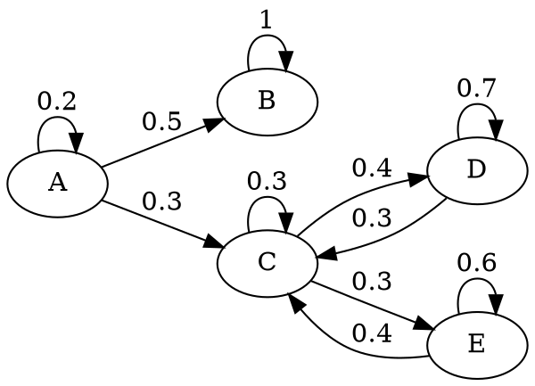
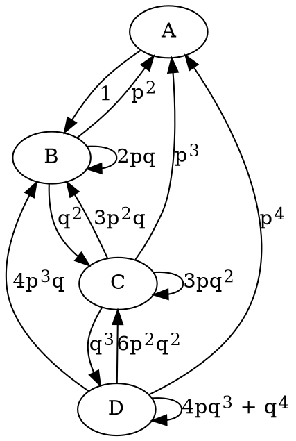
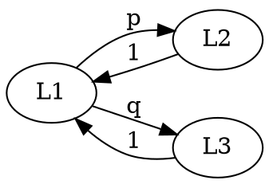
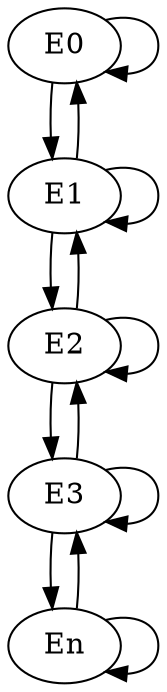
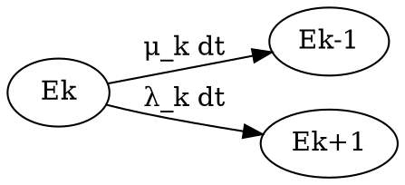
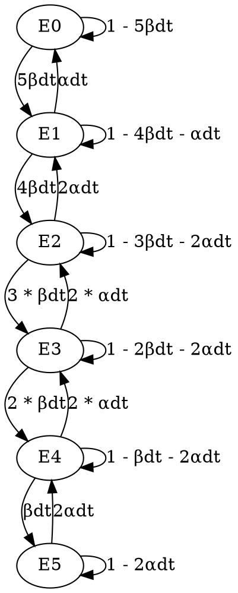
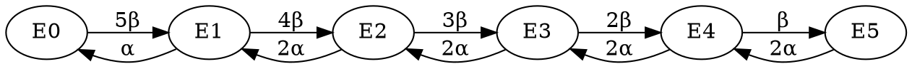
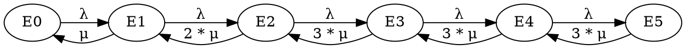

# Recherche Opérationnelle Stochastique

RO stochastique (contre le hasard)
**COURS PDF :**



## Rappels de probabilités

* Chaîne de Markov : processus aléatoire, discret, sans mémoire. 

* Processus de MARKOV continue
    
* Processus de naissance et de mort : modèle pour les files d'attente

Propriéte $\boxed{\text{ergodicité}}$

Dans un processus aléatoire, un processus ergodique est un processus qui, bien qu'imprévisible au niveau microscopique, se stabilise et devient prévisible au niveau macroscopique.

**Ex1 : Soit une main au bridge soit 13 cartes tirées au hasard dans un jeu de 52 cartes.**
1. Quelle est la probabilité d'avoir exactement $k$ as ? $(0\le k \le 4)$


>$$
>probabilité = \frac{\text{Nb. évènements favorables}}{\text{Nb. évènements probables}}
>$$
>$$
>q_k = \frac{\text{Nb. total de mains ayant k as}}{\text{Nb. total de mains}}
>$$
>
>"dénombrement"
>
>$$
>C^{13}_{52} = \frac{52!}{13!(52-13)!}
>$$
>
>$k \text{ as} \Rightarrow C^k_4$
>
>$\displaystyle \frac{(13-k) \text{ non-as}}{13 \text{ cartes}} \Rightarrow C^{13-k}_{48}$
>
>Nb total de mains ayant $k$ as $\Rightarrow C^{k}_{4}.C^{13-k}_{48}$
>
>$$
>q_k = \frac{C^{k}_{4} \cdot C^{13-k}_{48}}{C^{13}_{52}}
>$$
>$$
>q_0 = \frac{1 \cdot C^{13}_{48}}{C^{13}_{52}} = \frac{48! \cdot 39!}{ 35! \cdot 52!} = \frac{39 \times 38 \times 37 \times 36}{ 52 \times 51 \times 50 \times 49}
>$$
>$$
>\boxed {q_0 \simeq 0.304} \\
>q_1 \simeq 0.439 \\
>q_2 \simeq 0.213 \\
>q_3 \simeq 0.041 \\
>q_4 \simeq 0.003 \\
>\sum = 1
>$$

2. Proba. au moins 1 as ?

> $1-q_0 = q_1 + q_2 + q_3 + q_4 \simeq 0.696$ 

3. Quelle est la probabilité d'avoir une main rouge ?

>$$
>\frac{\text{Nb. total de "mains rouge"}}{\text{Nb. total de mains}} = \frac{C^{13}_{26}}{C^{13}_{52}} = \frac{26!}{13! \cdot 13!} \cdot \frac{13! \cdot 39!}{52!} \simeq 1.6 \times 10^{-5}
>$$

**Ex2 : 12 pièces, 4 pieces défectueuses, 8 pièces bonnes, On tire 3 pièces sans remise**
1. Proba. d'avoir 3 pieces bonnes ?

>$1^{ère}$ méthode. Comme précedement
>
>$$
>\frac{\text{Nb. jeux de 3 pièces bonnes}}{\text{Nb. jeux de 3 pièces}} = \frac{C^{3}_{8}}{C^{3}_{12}} = \frac{8!}{3! \cdot 5!} \cdot \frac{3! \cdot 9!}{ 12!} = \frac{8 \times 7 \times 6}{12 \times 11 \times 10} \simeq 0.255
>$$
>
>$2^{eme}$ methode On raisonne pièce apres pièce
>
>$1^{er}$ tirage : 4 défectueuses, 8 bonnes
>Proba $1^{ere}$ pièce bonne = $\frac{8}{12}$
>
>$2^{eme}$ tirage : 4 défectueuses, 7 bonnes
>Proba $1^{ere}$ pièce bonne = $\frac{7}{11}$
>
>$3^{eme}$ tirage : 4 défectueuses, 6 bonnes
>Proba $1^{ere}$ pièce bonne = $\frac{6}{10}$
>
>Proba 3 pièces bonnes = $\frac{8}{12} \times \frac{7}{11} \times \frac{6}{10}$


**Ex.3 Loi de BERNOUILLI**
- Coton 75% de fibres courtes (longueur $\le$ 45 mm) et 25% de fibres longues
On tire 3 fibres au hasard.

1. Probabilité de tirer 2 fibres longues et 1 fibre courte ?

> 1 Fibre tirée 
> Proba (1L) ? $0.25 = p$
> Proba (1C) ? $0.75 = q$
>
> Proba (2L, 1C) ?
>
> LOI BINOMIALE
>
>LLC $= p^2q$
>LCL $= p^2q$
>CLL $= p^2q$
>Proba (2L, 1C) $= 3p^2q = C^{2}_{3} p^2 q$
>
>$C^{2}_{3}$: nombre de manières de placer les 2 fibres longues parmi les 3

:::info
**Loi binomiale :**

Proba. (pile) = p
Proba. (face) = q
n lancers

Proba (m fois pile, n-m fois face) =
$$
\boxed{C^{m}_{n} p^m q^{n-m}}
$$
:::

**Ex.4 Proba. conditionelles**
    **Th. de BAYES**
    
Une urne $U_1$ contient 4 boules blanches
Une urne $U_2$ contient 3 boules blanches et 1 boule noire

On tire 2 boules dans une urne

1. 
    a. P(2B) tirage avec remise ?
    b. Sachant que la $1^{ère}$ boule était blanche. Quelle est la probabilité que la $2^{ème}$ le soit aussi ? Tirage avec remise.
2. Même questions avec tirage sans remise.

**1.a.**
>    Soit le tirage s'est fait dans l'urne U1 soit dans l'urne U2 (1 chance sur 2)
>
>$P(2B) = \frac12 P(2B | U1) + \frac12 P(2B | U2) = \frac12 \times 1 + \frac12 \times (\frac34)^2 = \frac{25}{32}$
    
**1.b.**
>    $\frac12 \times 1 + \frac12 \times \frac34 \times \frac23 = \frac34 =\frac{24}{32}$

**2.a**
>$P(A|B) \rightarrow$ est-il plus simple de calculer $P(B|A)$ ? Si oui $\rightarrow$ Th. de BAYES

:::info
**Théorème de BAYES :**
$$
\boxed{ P(A|B) = \frac{P(B|A) \times P(A)}{P(B)}}
$$
:::
>$$
>P(U1|1^{ere} b.b) = \frac{P(1^{ere} b.b|U1) \times P(U1)}{P(1^{ere} b.b)} = \frac{1 \times \frac12}{\frac12 \times 1 + \frac12 \times \frac34} = \frac47
>$$
>$$
>P(U2|1^{ere} b.b) = \frac{P(1^{ere} b.b|U2) \times P(U2)}{P(1^{ere} b.b)} = \frac{\frac34 \times \frac12}{\frac12 \times 1 + \frac12 \times \frac34} = \frac37
>$$
>Comme la première boule est blanche nous avons $\frac47$ chance d'être dans U1 et $\frac37$ chance d'être dans U2
>$$
>P(2^{e} b.b|1^{ere} b.b) = \frac47 \times 1 + \frac37 \times \frac34 = \frac{25}{28}
>$$

**2.b**
>$$
> \frac47 \times 1 + \frac37 \times \frac23 = \frac67 = \frac{24}{28}
>$$

**Ex.5**
Trois machines $A$,$B$ et $C$
La machine $A$ produit 25% des boulons, la machine $B$ 35% et la machine $C$ 40%.
La machine $A$ a 5% de boulons défectueux, la machine $B$ 4% et la machine $C$ 2%.

On tire 1 boulon au hasard. On trouve qu'il est défectueux

1. Proba. que le boulon ait été produit par $A$, Proba. que le boulon ait été produit par $B$, Proba. que le boulon ait été produit par $C$

$P(A) = 0.25$
$P(B) = 0.35$
$P(C) = 0.40$

$d$ = "défectueux"
$P(d|A) = 0.05$
$P(d|B) = 0.04$
$P(d|C) = 0.02$


>$P(A|d) = \frac{P(d|A) \cdot P(A)}{P(d)} = \frac{0.05 \cdot 0.25}{0.25 \cdot 0.05 + 0.35 \cdot 0.04 + 0.40 \cdot 0.02} = \frac{25}{69}$
>$P(B|d) = \frac{P(d|B) \cdot P(B)}{P(d)} = \frac{0.04 \cdot 0.35}{0.25 \cdot 0.05 + 0.35 \cdot 0.04 + 0.40 \cdot 0.02} = \frac{28}{69}$
>$P(C|d) = \frac{P(d|C) \cdot P(C)}{P(d)} = \frac{0.02 \cdot 0.40}{0.25 \cdot 0.05 + 0.35 \cdot 0.04 + 0.40 \cdot 0.02} = \frac{16}{69}$


## Chaines de MARKOV

C'est un modèle de processus :
- aléatoire
- discret
- sans mémoire

:::success
**Définition :**

On a un "SYSTÈME" observé à des instants discrets.
:::
**Exemple :**
Animal enfermé dans une cage avec 5 compartiments


$\tau$ = 1 seconde
Système = (animal; cage)
1 photo prise chaque seconde

À un instant d'observation quelconque $k_{\tau}$ le système se trouve dans un "état" et un seul (parmi une liste d'états possibles connus à l'avance)

On s'intéresse à la chaine formé par les états successifs à $t=0$, $t=\tau$, $t=2\tau$...

Ex: AABBBBB... ou ACCDDD...

On s'intéresse au mécanisme de "transition" (au changement d'état) entre 2 instants d'observation successifs

**Hypothèse**: On connait la probabilité conditionelle suivante : Proba., si le système est dans l'état $i$ à $t=k_{\tau}$ que le système passe dans l'état $j$ à $t=(k+1)_{\tau}$

On peut rassembler ces probabilités de transition dans une matrice M appelée la matrice de transition.

$M : n \times n$

$n =$ nb. états possibles

Pour notre exemple : 
$$
M =
\begin{pmatrix}
0,2 & 0,5 & 0,3 & 0   & 0   \\
0   & 1   & 0   & 0   & 0   \\
0   & 0   & 0,3 & 0,4 & 0,3 \\
0   & 0   & 0,3 & 0,7 & 0   \\
0   & 0   & 0,4 & 0   & 0,6 \\
\end{pmatrix}
$$


Si ce mécanisme de transition entre $k{\tau}$ et $(k+1){\tau}$ s'applique, la chaîne des états successifs observés s'appelle une "Chaîne de Markov"

C'est un modèle pour un processus : 
- aléatoire (probabilités)
- discret ($\tau$)
- $\boxed{\text{sans mémoire}}$ La probabilité de changement d'états ne dépend pas des instant précédent mais seulement de l'instant présent


Système sans mémoire


:::info
Ex de processus non Markov
- étudiant de l'EPITA -> états
- $\tau = 1$ année

Le changement d'état d'un étudiant de l'EPITA ne dépend pas que de l'instant présent.
:::

Une chaine de markov est caractérisée par
$\boxed{\text{Son graphe de transition}}$ : 
- * États <-> Sommets
- * Changements d'états <-> arc $(i,j)$
- * Probabilités <-> Valuation de l'arc $(i,j)$ $p_{ij}$





### Régime transitoire d'une chaine de Markov
**Hypothèses :**
- On connait l'état à $t=0$
- On connait la matrice $M$

Peut-on calculer dans quel état sera le système à $t=32 \cdot \tau$?
Non, mais on peut calculer des probabilités des différents états à $t=32 \cdot \tau$

 à $t=32 \cdot \tau$, on peut calculer $\Pi_{32} \rightarrow \text{vecteur } \Pi_{32} = (\Pi_{32}^A,\Pi_{32}^B,\cdots,\Pi_{32}^E)$

:::info
$$
\Pi_k = (\Pi_{k-1}) \times M \\\text{avec } k=1,2,...
$$
:::

Régime transitoire -> ensemble des vecteurs $\Pi_k$ : 
$\Pi_0 =$ (1 0 0 0 0)<- animal en $A$ à $t=0$
$\Pi_1 =$ ()
$\Pi_0 =$ ()
$\vdots$
$\Pi_{32} =$ ()


$k = 1$
$\Pi_1 = \Pi_0 \times M$
$\Pi_1 = (\Pi_1^A \Pi_1^B ... \Pi_1^E) =(\Pi_0^A \Pi_0^B ... \Pi_0^E) \times M$

$\Pi_1^E = \Pi_0^A \times 0.3 + \Pi_0^B \times 0 + \Pi_0^C \times 0.3 + \Pi_0^D \times 0.3 + \Pi_0^E \times 0.4$

L'animal était en $a$ à $t=0$ et il a fait la transition de $A$ vers $C$ entre $t = 0$ à $t = t$

$$
\boxed{
\require{cancel}
\cancel{\Pi_1} = \Pi_0 \times M\\
\cancel{\Pi_2} = \cancel{\Pi_1} \times M \\
\vdots \\
\Pi_{32} = \cancel{\Pi_{31}} \times M
}
$$
$$
\boxed{\Pi_{32} = \Pi_0 \times M^{32}}
$$

$\Pi_1 = \Pi_0 \times M =$ (0,2 0,5 0,3 0 0)
$\Pi_2 = \Pi_1 \times M =$ (0,04 0,60 0,15 0,12 0,09)


### Régime permanent d'une chaine de Markov → Ergodicité

La chaine de Markov est dite ergodique s'il existe une limite, appelee $\Pi_{\infty}$, ou $\Pi_*$, du vecteur $\Pi_k$, lorsque $k \rightarrow +\infty$, et si cette limite est indépendante de $\Pi_0$

Ici, la chaine de Markov n'est pas ergodique car si l'animal commence en E, il ne pourra pas aller en B mais si l'animal commence en B, il n'ira jamais en E. Condition 2 non remplie.

Problème simplifié → cage à trois compartiments

$$
M =
\begin{pmatrix}
0.3 & 0.4 & 0.3 \\
0.3 & 0.7 & 0   \\
0.4 & 0   & 0.6 \\
\end{pmatrix}
$$
:::info
$\boxed{\Pi_{\infty} = \Pi_{\infty} \times M}$
$\boxed{\displaystyle\sum_i \Pi_{\infty}^i = 1}$
calcul du vecteur $\Pi_{\infty}$ lorsque la chaine de Markov est ergodique
:::

$\Pi_{\infty} =$ ($\Pi_{\infty}^C$, $\Pi_{\infty}^D$, $\Pi_{\infty}^E$)
$\Pi_{\infty} =$ ($c$ $d$ $e$) ?

$$
(c\text{ }d\text{ }e) = (c\text{ }d\text{ }e) \times
\begin{pmatrix}
0.3 & 0.4 & 0.3 \\
0.3 & 0.7 & 0   \\
0.4 & 0   & 0.6 \\
\end{pmatrix}
$$


$c = 0.3c + 0.3d + 0.4e$
$d = 0.4c + 0.7d$
$e = 0.3c +        0.6e$
$c + d + e = 1$

$\Pi_{\infty} = (\frac{12}{37}, \frac{16}{37}, \frac{9}{37})$

$\boxed{\text{interpretation du vecteur } \Pi_{\infty} \text{lorsque la chaine de Markov est periodique}}$
stabilisation MACROSCOPIQUE "sorte de disparition du hasard"

#### Interpretation PONCTUELLE du vecteur $\Pi_{\infty}$
**Hypothese : la chaine de Markov est ergodique**


la probabilite d'observer un etat donne ne varie plus au cours du temps

#### Interpretation STATISTIQUE du vecteur $\Pi_{\infty}$


### Application / Ch. de Markov (p114)

- 4 véhicules à louer
- 1 véhicule loué $P(\text{panne}) = p$, $P(\text{non-panne}) = q = p - 1$
- 1 seule réparation en soirée
- Demande > offre
- Location seulement s'il y a au moins 2 véhicules à louer
- État du parc de véhicules au début de chaque journée: nb véhicules en état de marche

1) Modéliser le fonctionnement (Ch. de Markov)

- Système étudié ? parc de véhicules disponibles à la location
- Découpage temporel ?  

- Liste des états possibles ?
- Matrice de transition M ?
- Graphe de transition 


A $\rightarrow$ 1 véhicule en marche
B $\rightarrow$ 2 véhicule en marche
C $\rightarrow$ 3 véhicule en marche
D $\rightarrow$ 4 véhicule en marche

$M: n \times m$
$n$ : Nombre d'états possibles


$$
M=
    \begin{array}{c|cccc}
      & A & B & C & D \\
    \hline
    A & 0 & 1 & 0 & 0 \\
    B & p² & C^1_2pq & q² & 0 \\
    C & p^3 & C^2_3 p^2 \cdot q & C^1_3 p \cdot q^2 & q^3 \\
    D & p^4 & C^3_4 p^3 \cdot q & C^2_4 p^2 \cdot q^2 & q^4 + C^1_4p \cdot q^3 \\
    \end{array}
$$

$P_{ij}=$ Probabilité, si le système est dans l'état $i$ à $t=k\tau$ que le système soit dans l'état $j$ à $t=(k+1)\tau$

$M$ se remplit ligne par ligne.

$1^{ère}$ ligne
++Hypothèse:++  $\boxed{\text{État } A \text{ à } t=k\tau}$
Quels sont les états possibles à $t=(k+1)\tau$ ? Et avec quelles probablilités ?

$2^{ème}$ ligne
++Hypothèse:++  $\boxed{\text{État } B \text{ à } t=k\tau}$

2 véhicules loués $\rightarrow$ 

- 0 panne $q^2$
- 1 panne $p \cdot q + p \cdot q = 2pq = C^1_2pq$
- 2 pannes $p^2$

$(p+q)^2 = p^2 + 2pq + q^2 = 1$


$3^{ème}$ ligne
++Hypothèse:++  $\boxed{\text{État } C \text{ à } t=k\tau}$

3 véhicules loués $\rightarrow$

- 0 panne $\rightarrow q^3$
- 1 panne $\rightarrow C^1_3 p \cdot q^2 = 3p \cdot q^2$
- 2 pannes $\rightarrow C^2_3 p^2 \cdot q = 3p^2 \cdot q$
- 3 pannes $\rightarrow p^3$


$4^{ème}$ ligne
++Hypothèse:++  $\boxed{\text{État } D \text{ à } t=k\tau}$

4 véhicules loués $\rightarrow$

- 0 panne $\rightarrow q^4$
- 1 panne $\rightarrow C^1_4 p \cdot q^3 = 4p \cdot q^3$
- 2 pannes $\rightarrow C^2_4 p^2 \cdot q^2 = 6p^2 \cdot q^2$
- 3 pannes $\rightarrow C^3_4 p^3 \cdot q = 4p^3 \cdot q$
- 4 pannes $\rightarrow p^4$




2) Les 4 véhicules sont en état de marche à $t=0$.
    
    - Quelles sont les probabilités des différents états à $t=\tau$ ?
    - Quelles sont les probabilités des différents états à $t=2\tau$ ?


$\Pi_k = (\Pi^A_k \dots \Pi^D_k)$, $k=1,2,\dots$ 

$\Pi^A_k =$ Proba état A à $t=k\tau$

$\Pi_k = (\Pi_{k-1} \times M)$, $k=1,2,\dots$ 

$\Pi_0 =$ (0 0 0 1)
à $t=0$, on est dans l'état $D$


$$
M =
\begin{pmatrix}
0 & 1 & 0 & 0 \\
\frac14 & \frac24 & \frac14 & 0 \\
\frac18 & \frac38 & \frac38 & \frac18 \\
\frac1{16} & \frac4{16} & \frac6{16} & \frac5{16}\\
\end{pmatrix}
$$

$\Pi_1 =$ ($\frac1{16}$ $\frac4{16}$ $\frac6{16}$ $\frac5{16}$)

$\Pi_2 = \Pi_1 \times M =$ ($\frac{33}{256}$ $\frac{104}{256}$ $\frac{82}{256}$ $\frac{37}{256}$)

3) Au bout d'un grand nb de jours de location, existe-t-il une limite aux probabilités des différents états ?
    Si Oui, calculer cette limite

Ici, la chaine de Markov est ergodique car les 3 conditions suffisantes sont vérifiées :

- Graphe de transition **FINI**
- Graphe de transition **FORTEMENT CONNEXE**
- Au moins 1 boucle $\rightarrow$ ici ++3 boucles++

$\implies$ Vecteur $\Pi_\infty$ ($\Pi^*$) existe

$$
\begin{cases}
\Pi_{\infty} = (\Pi_{\infty}) \times M \\
\sum_i \Pi_{\infty}^i = 1
\end{cases}
$$

$\Pi_{\infty} = (\Pi_{\infty}^A, \Pi_{\infty}^B, \Pi_{\infty}^C, \Pi_{\infty}^D)$
$=a,b,c,d$

$$
\begin{cases}
a = \frac14b + \frac18c + \frac1{16}d \\
b = a + \frac24b + \frac38c + \frac4{16}d \\
c = \frac14b + \frac38c + \frac6{16}d \\
d = \frac18c + \frac5{16}d \\
\end{cases}
$$


$\Pi_\infty =$ ($\frac{61}{361}$ $\frac{196}{361}$ $\frac{88}{361}$ $\frac{16}{361}$)

++Interprétation statistique de l'ergodicité.++


361 ≃ 365 jours

- 2 mois, état $A$, 0 véhicule loué $\rightarrow$ recette 0
- 6,5 mois, état $B$, 2 véhicules loués $\rightarrow$ ___ 
- 3 mois, état $C$, 3 véhicules loués $\rightarrow$ ___ 
- 0,5 mois, état $D$, 4 véhicules loués $\rightarrow$ ___ 

4) 2 cas limites $\rightarrow$ le processus n'est plus aléatoire

a)
>$p = 0$
>$$
\rightarrow M =
\begin{pmatrix}
0 & 1 & 0 & 0 \\
0 & 0 & 1 & 0 \\
0 & 0 & 0 & 1 \\
0 & 0 & 0 & 1 \\
\end{pmatrix}
$$
>
>```graphviz
>digraph G {
> A -> B [label="1"];
> B -> C [label="1"];
> C -> D [label="1"];
> D -> D [label="1"];
>}
>```
>Au bout de 3 jours au plus, le système est piégé dans l'état $D$ $\rightarrow$ État 


b)
>$p = 1$
>$$
\rightarrow M =
\begin{pmatrix}
0 & 1 & 0 & 0 \\
1 & 0 & 0 & 0 \\
1 & 0 & 0 & 0 \\
1 & 0 & 0 & 0 \\
\end{pmatrix}
$$
> Cycle Absorbant : A - B - A - B - A - B $\dots$
>```graphviz
>digraph G {
> A -> B [label="1"];
> B -> A [label="1"];
> C -> A [label="1"];
> D -> A [label="1"];
>}
>```


## Processus de Markov

C'est la généralisation ++en temps continu++ des Chaînes de Markov


(si quelqu'un a mieux qu'une image)


Cas particulier :  Le processus de naissance & de mort $\implies$ File d'attente

Ce qui est commun avec les Chaînes de Markov $\rightarrow$
 
 - Système observé
 - À $t$, le système est dans un état et un seul.

++Différence++ $\rightarrow$ "transitions" (changements d'état)

 - Chaîne de Markov $\rightarrow$   $k\tau \rightarrow (k+1)\tau$ transitions

 - Processus de Markov $\rightarrow$ 
$t + dt$ instant "voisin" de l'instant $t$


$dt \rightarrow$ infiniment petit

:::info
++Hypothèse:++

Les changements d'états entre $t$ et $t+dt$ sont dus à des processus aléatoires tous régis par des **LOIS de POISSON**

++Processus de Markov++ $\rightarrow$ $\boxed{\text{POISSON PARTOUT}}$
    
:::

++Rappel loi de POISSON++
Permet de modéliser des arrivées d'usagers dans un bureau si 3 hypothèses s'appliquent:


- Arrivées indépendantes entre elles
- Arrivées à **FLUX STATIONNAIRE**
    $\rightarrow$ Les observations entre $t$ et $t+h$ ne dépendent que de h
- Arrivées **NON GROUPÉES**

:::info
++Définition++

Probabilité / $n$ évènements pendant un temps $t$:
$\boxed{P_n(t)=\frac{(\lambda t)^n}{n!} \cdot e^{-\lambda t}}$

Loi de Poisson de paramètre $\lambda \rightarrow$ TAUX $\rightarrow$ $(-\text{temps})^{-1}$ 
:::


++Conséquence++
Entre $t$ et $t+dt$, la probabilité d'occurence de **1** évènement vaut $\boxed{\lambda \cdot dt}$

Probabilité d'occurence de 2 évènements pendant $dt$
$(\lambda dt)^2$ **négligeable**

Probabilité d'occurence de $n$ évènements **négligeable**

++Poste++


Proba 1 arrivée : $\boxed{\lambda \cdot dt}$
Proba 1 sortie : $\boxed{\mu \cdot dt}$

++2 lois de Poisson++

- Lois des arrivées $\rightarrow$ POISSON taux $\lambda$
- Lois des départs $\rightarrow$ POISSON taux $\mu$

Proba(1 entrée et 1 sortie pendant dt) $\rightarrow$ ≃ 0

entrée $\rightarrow$ $\boxed{\lambda dt}$, sortie $\rightarrow$ $\boxed{\mu dt}$ 

$(\lambda \cdot \mu)(dt)^2 << dt$
Négligeable


++Exemple++ Magasin de stockage de composants électroniques:



++Magasin++

- 3 lieux de stockages
- 2 robots sont chargés de prélever des composants
- Le prélèvement d'un composant dans le lieu $L_i \rightarrow$ loi de POISSON de taux $\mu_i$

[TODO SCHEMA LIGNE]

- Probabilité **1** prélèvement $= (\mu_i) \cdot dt$
- Probabilité plus de **1** évènements **négligeable** $\leftarrow$ **IMPOSSIBLE**

Chaque robot se déplace selon la loi suivante:


>**++En L1++**
>- Il reste en L1 jusqu'à ce qu'il puisse prélever 1 composant
>- Dès que le prélèvement en L1 est fait, le robot va en L2 avec la proba $p$, ou en L3 avec la proba $q=1-p$
>- Ce déplacement est supposé instantané

>**++En L2(L3)++**
>- Il reste en L2(L3) jusqu'à ce qu'il puisse prélever un composant en L2(L3)
>- Dès que le prélèvement est effectué en L2(L3), le robot retourne en L1

- Le $1^{er}$ robot arrivé en un lieu sera le $1^{er}$ servi

Le robot qui vient d'arriver dans le même lieu ne pourra pas bouger entre $t$ et $(t+dt)$

**++Modélisation du fonctionnement à l'aide d'un Processus de Markov++**

- Système étudié $\rightarrow$ { 3 lieux, 2 robots }
- Découpage du temps : **NON** (Car ici, le temps est une variable continue) 

- À $t$ donné, le système est dans un état et un seul. $\rightarrow$ liste des **états** possibles. 

(États caractérisés par le nombre de robots présents en un lieu donné)

À $t$, chaque robot est forcément dans un des 3 lieux. On a donc que **6 états possibles**

- 2 robots au même endroit
    2 0 0
    0 2 0
    0 0 2
- Endroits différents
    1 1 0
    1 0 1
    0 1 1
    
- Graphe de transition entre $t$ et $(t + dt)$

```graphviz
digraph G {
 002 -> 101;
 101 -> 002;
 101 -> 011;
 011 -> 101;
 101 -> 200;
 200 -> 101;
 011 -> 110;
 110 -> 011;
 110 -> 020;
 020 -> 110;
 200 -> 110;
 110 -> 200;
}
 ```
 


**++6 Hypothèses successives++** pour remplir le graph de transition.

:::info
$1^{ère}$ Hypothèse :
Le système est dans l'état 200 à $t$


Graphe simplifié de transition
1) on ne dessine plus les boucles
2) on value le graphe avec des TAUX de PROBABILITES $\rightarrow (\frac{\text{Probabilité}}{dt})$


graphe simplifié de transition

### Régime permanent d'un processus de Markov (ERGODICITE)

* QUAND? $\rightarrow$ condition suffisantes que pour les Ch. de Markov
* COMMENT CALCULER $\Pi_{\infty}$ lorsque le processus est ergodique
* INTERPRETATION

---

- Le processus de Markov est considéré ergodique car les 3 conditions suffisantes sont bien vérifiées
- Calcul du vecteur $\Pi_{\infty}$ lorsque le processus de Markov est ergodique.

:::

### Th. des COUPES

- Coupe = ligne fermée isolant 1 ou plusieurs sommets du graphe
- La probabilité de sortir de la coupe entre $t$ et $t+dt$ est égale à la probabilité d'entrer dans la coupe en régime permanent


On cherche le vecteur $\Pi_\infty = (\Pi_\infty^{200}, \Pi_\infty^{020}, \cdots, \Pi_\infty^{011})$ ?

Ex: coupe C1

:::info
$\Pi_{200}^{*} = \Pi_\infty^{200}$
:::

Proba sortie:

vers le haut $\underbrace{\Pi_{200}^*}_{\text{proba état 200 à t}} \times \underbrace{\mu_1 \cdot q \cdot dt}_{\text{transition vers l'état 101 entre t et t + dt}}$


vers la droite


Proba entrée
$$
\boxed{\underbrace{\Pi_{101}^* \cdot \mu_3 dt}_{\text{venant du haut}} + \underbrace{\Pi_{110}^* \cdot \mu_2 dt}_{\text{venant de la droite}}}
$$

Proba sortie
$$
\boxed{\Pi_{200}^* \cdot \mu_1 q dt + \Pi_{200}^{*} \cdot \mu_1 p dt}
$$


Application numérique

$\mu = \mu_1 = \mu_2 = \mu_3$
$p = q = \frac12$

$\rightarrow$ réduction de 6 à 4 inconnues


```graphviz
digraph G {
    rankdir=LR;
    L1 -> L2 [label="0.5"];
    L1 -> L3 [label="0.5"];
}

```
L2 et L3 sont interchangeables

$$
\begin{cases}
\Pi_{020}^* = \Pi_{002}^* \\
\Pi_{101}^* = \Pi_{110}^*
\end{cases}
$$

Il suffit d'appliquer 3 fois le Th. des coupes

Après résolution du system de 4 équations à 4 inconnues, on trouve:

$$
\boxed{
\Pi_\infty^{200} = \frac{4}{11} \\
\Pi_\infty^{011} = \frac{1}{11} \\
\Pi_\infty^{110} = \Pi_\infty^{101} = \frac{2}{11} \\
\Pi_\infty^{020} = \Pi_\infty^{002} = \frac{1}{11}
} \\
\forall \mu
$$

Interprétation du vecteur $\Pi^*$

Ex: quel est le nb moyen de robots en L1? L2? L3?

$<x> = \sum_i x_i \cdot p(x_i)=$ moyenne de la variable aléatoire $x$


en L1
$$
\boxed{2}00 \rightarrow \frac{4}{11} \\
\boxed{0}11 \rightarrow \frac{1}{11} \\
\boxed{1}10 \rightarrow \frac{2}{11} \\
\boxed{1}01 \rightarrow \frac{2}{11} \\
\boxed{0}20 \rightarrow \frac{1}{11} \\
\boxed{0}02 \rightarrow \frac{1}{11} 
$$

$\bar{m_{L_1}} = 2 \times \frac{4}{11} + 1 \times \frac{2}{11} + 1 \times \frac{2}{11}$
$= \boxed{\frac{12}{11}} \simeq 1$

en L2
$$
2\boxed{0}0 \rightarrow \frac{4}{11} \\
0\boxed{1}1 \rightarrow \frac{1}{11} \\
1\boxed{1}0 \rightarrow \frac{2}{11} \\
1\boxed{0}1 \rightarrow \frac{2}{11} \\
0\boxed{2}0 \rightarrow \frac{1}{11} \\
0\boxed{0}2 \rightarrow \frac{1}{11} 
$$

$\bar{m_{L_2}} = \frac{5}{11}$

en L3
$$
20\boxed{0} \rightarrow \frac{4}{11} \\
01\boxed{1} \rightarrow \frac{1}{11} \\
11\boxed{0} \rightarrow \frac{2}{11} \\
10\boxed{1} \rightarrow \frac{2}{11} \\
02\boxed{0} \rightarrow \frac{1}{11} \\
00\boxed{2} \rightarrow \frac{1}{11} 
$$


$\bar{m_{L_3}} = \frac{5}{11}$

$\rightarrow \boxed{\sum = 2}$

### Processus de NAISSANCE et de MORT

- C'est un processus de MARKOV
- Les états normes $E_k$ sont associées à un nombre unique k $\longrightarrow$ "nombre d'usagers" présents à $t$

**Ex:**

Ceci est bien un processus de naissance et de mort .

Pb de robots se deplaçant en 3 lieux $\longrightarrow$ Pas un processus de naissance et de mort $\longrightarrow$ etats 200, 020, etc... 
 3 paramètres
  
**Conséquences**

l'etat $E_k$ n'a que 2 etats voisins


entre $t$ et $(t + dt)$ il y a $\boxed{\text{au plus}}$ 1 seul événement (consequence de la loi de POISSON)


**Ex:** Bureau de Poste: entre $t$ et $(t + dt)$, 3 possibilités
1. Une personne entre $\Rightarrow$ transition de $E_k$ vers $E_{k+1}$ NAISSANCE
2. Une personne sort $\Rightarrow$ transition de $E_k$ vers $E_{k-1}$ MORT
3. Rien ne se passe $\Rightarrow$ le système reste donc dans l'etat $E_k$

>**Remarque**
>
>2 personnes rentre entre $t$ et $(t + dt)$ IMPOSSIBLE (proba de $(\lambda d t)^2 \ll \lambda d t$ donc negligeable)
> 1 personne sort et une personne sort pendant le meme $dt$ IMPOSSIBLE
> (proba de $(\lambda \mu)(dt)^2$ toujours negligible)

$\Rightarrow$ Graphe de transition




Tout les processus de Naissance et de Mort ont le même graphe de transition (au nombre de maillons près).

Le régime permanent est étudié une fois pour toutes
$\implies$ Pas besoin du **Théorème des Coupes**

Formules etablies pour toutes




$\lambda_k$ = TAUX de NAISSANCE  \/secondes
$\mu_k$ = TAUX DE MORTS a partir de l'etat $E_k$

***Régime permanent du Processus de Naissance et de Mort***

Dans le cas du système *fermé* (nb. fini d'états: $E_0$, $E_1$, $\dots$, $E_n$ $\rightarrow$ Capacité MAXI fixée)

- Graphe **FINI**
- Graphe **FORTEMENT CONNEXE** (De n'importe quel état, on peut accéder à n'importe quel autre état)
- Au moins **une boucle** (ici $(N+1)$ boucles, une boucle en chaque sommet)

Tous les Processus de Naissance et de Morts *fermés* sont ergodiques, et on a calculé une fois pour toutes le vecteur $\Pi^*$


$$
\Pi^* = (\Pi_0^*, \Pi_1^*, \dots, \Pi_N^*) \\
\Pi^*_1 = \frac{\lambda_0}{\mu_1} \cdot \Pi^*_0 \\
\Pi^*_2 = \frac{\lambda_1}{\mu_2} \cdot \Pi^*_1 = \frac{\lambda_1}{\mu_2} \cdot \frac{\lambda_0}{\mu_1} \cdot \Pi^*_0 \\
\Pi^*_3 = \frac{\lambda_2}{\mu_3} \cdot \Pi^*_2 = \frac{\lambda_2}{\mu_3} \cdot \frac{\lambda_1}{\mu_2} \cdot \frac{\lambda_0}{\mu_1} \cdot \Pi^*_0 \\
\Pi^*_k = \frac{\displaystyle \prod_{i=0}^{k-1} \lambda_i}{\displaystyle \prod_{j=1}^{k} \mu_j} \times \Pi^*_0
$$

On ecrit que 
$$
\boxed{\displaystyle \sum_{i=0}^{\mathbb N} \Pi_i^*} = 1 \Rightarrow \Pi_0^*\\
\Pi_0^* + \Pi_1^* + \cdots + \Pi_{\mathbb N}^* = 1\\
\Pi_0^*(1 + \frac{\lambda_0}{\mu_1} + \frac{\lambda_1 \lambda_0}{\mu_2 \mu_1} + \cdots) = 1 \Rightarrow \boxed{\Pi_0^*}
$$


***Application***

- Calcul pratique du vecteur $\Pi^*$
- Inteprétation de $\Pi^*$


***Exercice page 116***
5 Personnes utilisant 2 terminaux informatiques


Chaque comptable a besoin d'acceder a un terminal ++en moyenne 5 fois par heures++, selon une ++loi de POISSON de taux $\beta$++
$$
\boxed{
\beta = 5 (\text{heure})^{-1}
}
$$
Chaque terminal a une ++durée moyenne de transaction de 4 minutes++ selon une **loi EXPONENTIELLE**


Taux = Nb moyen de transactions / heures
$\alpha = 15\text{ transaction/h } = 15(\text{heure})^{-1}$


Cloison ++non vitrée++ $\implies$ 3 places d'attente

On s'intéresse ++au fonctionnement de la salle informatique++

$\Rightarrow \boxed{\text{modeliser}}$ sous la forme d'un Pr de N-M
combien d'états possibles ?
dessiner le graphe de transition

6 états possibles $E_0,E_1,\cdots,E_5$




> E1 - > E2
> Question : On a pas plutôt $4\beta dt + (1 - \alpha dt)$ ?
> (our prendre en compte qu'un comptable ne doit pas partir)
> Reponse : Non car POISSON $\implies$ une action à la fois

> Question : Pourquoi que $2\alpha dt$ ?
> Reponse : Car il n'y a que deux terminaux, donc mâme avec 4 personnes en attente, seules 2 peuvent terminer leurs travail

Probabilité de la transition $E_0 \rightarrow E_1$ entre $t$ et $(t+dt)$ ?
$\rightarrow 5 \cdot \beta dt$ (Ou entre les 5 probabilités $\beta dt$)
$\implies E_0 \rightarrow E_0 = 1 - 5 \cdot \beta dt$


***Calcul du vecteur $\Pi^*$***

On pose:
$\psi = \frac{\beta}{\alpha} = \frac{5(h)^1}{15(h)-1}$
$\psi = \frac13$

>Graphe de transition ***simplifié***:
>


**Attention, ce ne sont plus des probabilités.**

$\Pi_1^* = \frac{5\beta}{\alpha} \times \Pi_0^* = 5 \psi \times \Pi_0^*$
$\Pi_2^* = \frac{4\beta}{2\alpha} \times 5 \psi \times \Pi_0^* = 10 \psi^2 \times \Pi_0^*$
$\Pi_3^* = \frac{3\beta}{2\alpha} \times 10 \psi^2 \times \Pi_0^* = 15 \psi^3 \times \Pi_0^*$
$\Pi_4^* = \frac{2\beta}{2\alpha} \times 15 \psi^3 \times \Pi_0^* = 15 \psi^4 \times \Pi_0^*$
$\Pi_5^* = \frac{\beta}{2\alpha} \times 15 \psi^4 \times \Pi_0^* = \frac{15}2 \psi^5 \times \Pi_0^*$

$\Pi_0^*(1 + 5 \psi + 10 \psi^2 + 15 \psi^3 + 15 \psi^4 + \frac{15}2 \psi^5) = 1$
$\psi = \frac13 \implies  \boxed{\Pi_0^* = \frac{162}{737}}$
$\boxed{\Pi_1^* = \frac{270}{737}}$
$\boxed{\Pi_2^* = \frac{180}{737}}$
$\boxed{\Pi_3^* = \frac{90}{737}}$
$\boxed{\Pi_4^* = \frac{30}{737}}$
$\boxed{\Pi_5^* = \frac{5}{737}}$

Calculer le nombre moyen de terminaux utilises $\in$ [0,2]
$\boxed{<x> = \displaystyle \sum_i x_i \times p(x_i)}$

| 6 etats                   | $E_0$             | $E_1$             | $E_2$             | $E_3$            | $E_4$            | $E_5$           |
| ------------------------- | ---               | ---               | ---               | ---              | ---              | ---             |
| proba en régime permanent | $\frac{162}{737}$ | $\frac{270}{737}$ | $\frac{180}{737}$ | $\frac{90}{737}$ | $\frac{30}{737}$ | $\frac{5}{737}$ |
| Nb de terminaux utilisés  | $0$ | $1$ | $2$ | $2$ | $2$ | $2$ |


$\implies n = \frac{270}{737} + 2 (\frac{180}{737} + \frac{90}{737} +\frac{30}{737} +\frac{5}{737}) \simeq 1,19$

- Temps moyen perdu en attente par heure de fonctionnement, cumule sur les 5 comptables

Un comptable peut etre :	
- dans un bureau -> travail
- devant un terminal -> travail
- en place d'attente -> repos

1 heure -> 5 heures paye
quel est le temps total cumulé en attente / heure

> $\frac{90}{737} + 2 * \frac{30}{737} + 3 * \frac{5}{737} \text{heure} = \frac{165}{737}h \simeq 0,224h$ soit 13 minutes et 26 secondes
> sur 5 heures de payes il y a 13'26" (4,8%) attente et 4h$\frac34$ de travail (95,2%)
> 

- duree moyenne de transaction passe de 4' a 5'
- Le temps d'attente cumule va augmenter et on suppose qu'il devient excessif
- Pour ameliorer le fonctionement on fait l'aquisition d'un troisieme terminal
- Cette acquisition compense tel l'augmentation du temps d'attente cumule ?


$\psi = \frac{\beta}{\alpha} = \frac{5(h)^1}{12(h)-1}$
$\psi = \frac{5}{12}$

$\Pi_1^* = \frac{5\beta}{\alpha} \times \Pi_0^* = 5 \psi \times \Pi_0^*$
$\Pi_2^* = \frac{4\beta}{2\alpha} \times 5 \psi \times \Pi_0^* = 10 \psi^2 \times \Pi_0^*$
$\Pi_3^* = \frac{3\beta}{3\alpha} \times 10 \psi^2 \times \Pi_0^* = 10 \psi^3 \times \Pi_0^*$
$\Pi_4^* = \frac{2\beta}{3\alpha} \times 10 \psi^3 \times \Pi_0^* = \frac{20}{3} \psi^4 \times \Pi_0^*$
$\Pi_5^* = \frac{\beta}{3\alpha} \times \frac{20}{3} \psi^4 \times \Pi_0^* = \frac{20}{9} \psi^5 \times \Pi_0^*$

$\Pi_0^*(1 + 5 \psi + 10 \psi^2 + 10 \psi^3 + \frac{20}{3} \psi^4 + \frac{20}{9} \psi^5) = 1$
$\Pi_0^*(1 + \frac{25}{12} + \frac{250}{144} + \frac{1250}{1728} + \frac{12500}{62208}^4 + \frac{62500}{2239488}) = 1$
$\Pi_0^* \simeq 0,173$
$\Pi_1^* \simeq 0,360$
$\Pi_2^* \simeq 0,3$
$\Pi_3^* \simeq 0,127$
$\Pi_4^* \simeq 0,034$
$\Pi_5^* \simeq 0,005$

Temps moyen perdu :	
$\Pi_4^* + 2 * \Pi_5^* \text{ heure} \simeq 0,044h$ soit 2'38"

**File d'attente** Notation de Kendall

A/B/S/N/discipline

$\rightarrow$ S = nb de "serveurs"
$\rightarrow$ N = Nb total d'éléments dans le système
$\rightarrow$ A = loi des arrivées
$\rightarrow$ B = loi des services
$\rightarrow$ discipline = FIFO

M Markovien

Le processus de $N$ et de $M$ permet d'étudier les files d'attente du type

$\rightarrow$ $M/M/S/N$ ()

**Application P117**

-> 3 bureaux
-> les usagers arrivents suivant une loi de Poisson de taux $\lambda$
-> la salle d'attente contient 2 places


Durée aléatoire d'un service $\rightarrow$ Loi exponentielle de taux $\mu$

$\implies$ Les événements "fin de service" (c'est-à-dire les sorties) $\rightarrow$ Loi de **POISSON** de taux $\mu$




$\Pi_1^* = \frac{\lambda}{\mu} \times \Pi_0^* = \psi \times \Pi_0^*$
$\Pi_2^* = \frac{\lambda}{2\mu} \times \frac12 \psi \times \Pi_1^* = \frac12 \psi^2 \times \Pi_0^*$
$\Pi_3^* = \frac{\lambda}{3\mu} \times \frac13 \psi^2 \frac12 \psi^2 \times \Pi_0^* = \frac16 \psi^3 \times \Pi_0^*$
$\Pi_4^* = \frac{\lambda}{3\mu} \times  \frac16 \psi^3 \times \Pi_0^* = \frac1{18} \psi^4 \times \Pi_0^*$
$\Pi_5^* = \frac{\lambda}{3\mu} \times \frac1{18} \psi^4 \times \Pi_0^* = \frac1{54} \psi^5 \times \Pi_0^*$

$\psi = 2$
$\Pi_0^* = (1 + \psi +  \frac12 \psi^2 + \frac16 \psi^3 + \frac1{18} \psi^4 + \frac1{54}) = 1$
$\Pi_0^* = \frac{27}{211} \simeq 0,128$
$\Pi_1^* \simeq 0,256$
$\Pi_2^* \simeq 0,256$
$\Pi_3^* \simeq 0,171$
$\Pi_4^* \simeq 0,114$
$\Pi_5^* \simeq 0,076$

Sachant que $\lambda$ est 10 arrives a l'heure, evaluer le nombre moyen de client renoncant a attendre par tranche d'une heure

Cela correspond au nombre d'arrive alors que l'on est dans l'etats $\Pi_5^*$ soit $\lambda * \Pi_5^* = 0,76$
On a donc 0,76 client par heure qui renonce a attendre.


